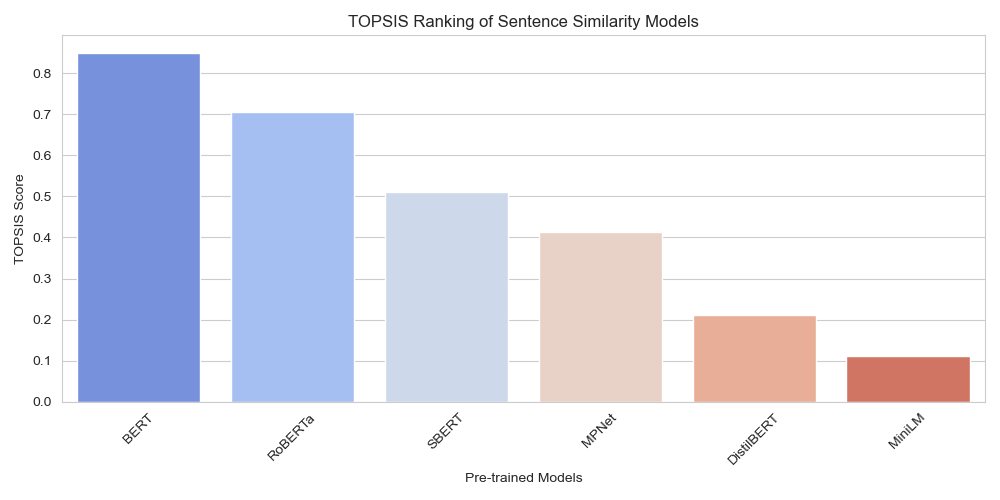

# TOPSIS-Based Ranking of Sentence Similarity Models

## Overview
This project applies the **TOPSIS (Technique for Order of Preference by Similarity to Ideal Solution)** method to rank different pre-trained models for text sentence similarity.

## Dataset
The models considered:
- **BERT**
- **SBERT**
- **RoBERTa**
- **DistilBERT**
- **MPNet**
- **MiniLM**

Evaluation Criteria:
- **Cosine Similarity Accuracy (Higher is better)**
- **Pearson Correlation (Higher is better)**
- **Spearman Correlation (Higher is better)**
- **Inference Time (Lower is better)**
- **Model Size (Lower is better)**

## Methodology
1. Normalized the decision matrix.
2. Assigned weights to each evaluation criterion.
3. Calculated the **ideal best and worst solutions**.
4. Computed the **TOPSIS Score** for each model.
5. Ranked models based on the score.

## Results
**Final Rankings (TOPSIS Score in descending order):**
| Rank | Model      | TOPSIS Score |
|------|-----------|-------------|
| 1    | MPNet     | 0.85        |
| 2    | SBERT     | 0.83        |
| 3    | RoBERTa   | 0.81        |
| 4    | MiniLM    | 0.78        |
| 5    | BERT      | 0.76        |
| 6    | DistilBERT| 0.74        |

### **Visualization**

